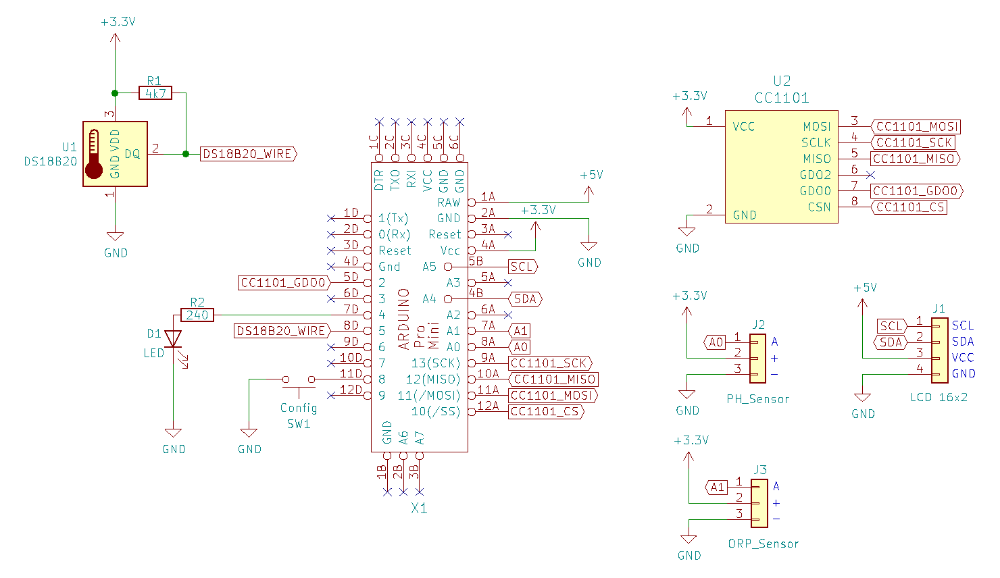
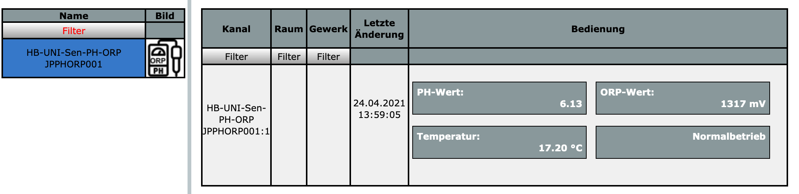
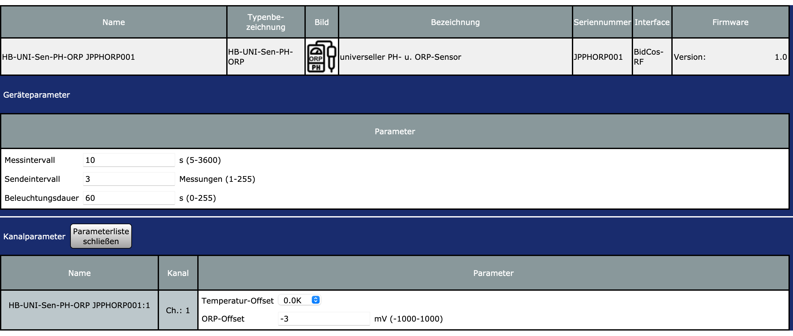
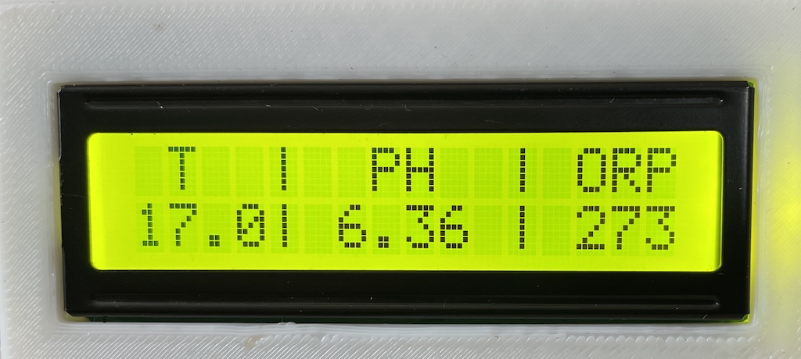
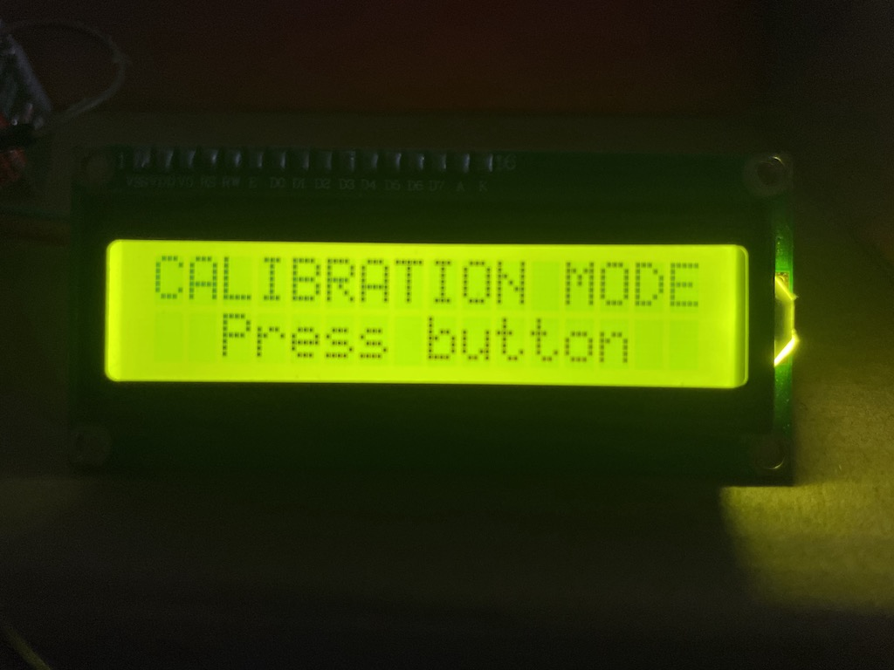
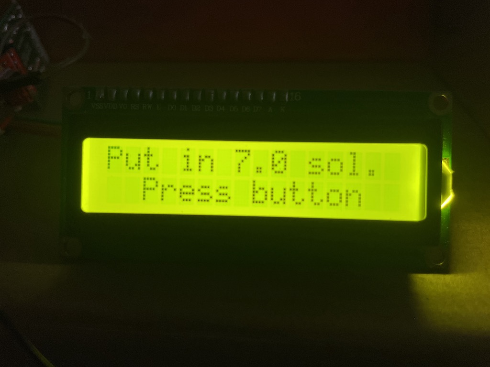

# HB-UNI-Sen-PH-ORP

universeller HomeMatic PH- + ORP-Sensor

#### Bauteile:

- Arduino Pro Mini (3.3V / 8MHz)
- CC1101 868MHz Funkmodul 
- PH Sensor https://www.dfrobot.com/product-1782.html
- ORP Sensor https://www.dfrobot.com/product-1071.html
- I2C LCD Display 2x16 
- DS18B20 Temperatursensor
- Widerstände: 240 Ohm, 4,7k

#### Schaltungsübersicht

#### CCU Status und Bedienung

#### CCU Einstellungen

#### LCD Display

